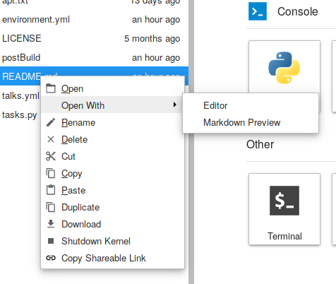
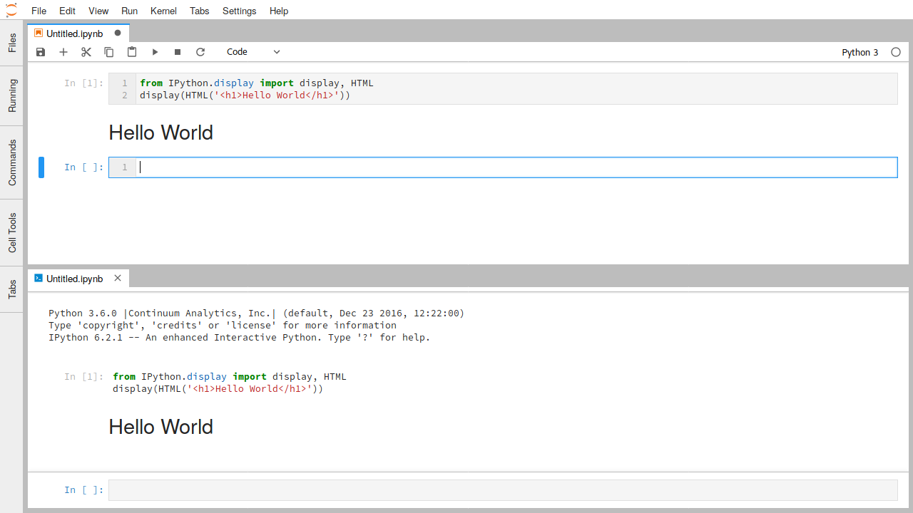
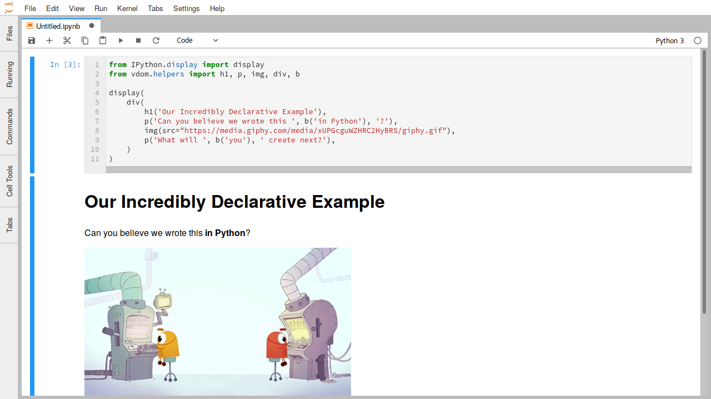

.. _file-and-output-formats:

文件和输出格式
-----------------------

JupyterLab提供统一的体系结构，用于以各种格式查看和编辑数据。 无论数据是在文件中还是由内核提供为笔记本或代码控制台中的富单元输出，此模型都适用。

对于文件，数据格式由文件的扩展名检测（如果没有扩展名，则检测整个文件名）。 单个文件扩展名可能会注册多个编辑者或查看者。 例如，Markdown文件（``.md``）可以在文件编辑器中编辑，也可以呈现为HTML格式。 您可以通过右键单击文件浏览器中的文件名并使用“Open With”子菜单打开文件的不同编辑器和查看器：

要在笔记本电脑或代码控制台中使用这些不同的数据格式作为输出，您可以使用您正在使用的内核的相关显示API。 例如，IPython内核提供了各种便利类来显示丰富的输出：

.. code:: python

    from IPython.display import display, HTML
    display(HTML('<h1>Hello World</h1>'))

运行此代码将在笔记本或代码控制台单元格的输出中显示HTML：

IPython显示功能还可以从密钥字典（MIME类型）和值（MIME数据）构造原始丰富输出消息：

.. code:: python

    from IPython.display import display
    display({'text/html': '<h1>Hello World</h1>', 'text/plain': 'Hello World'}, raw=True)

其他Jupyter内核提供类似的API。

本节的其余部分将重点介绍JupyterLab默认支持的一些常见数据格式。 JupyterLab扩展还可以添加对其他文件格式的支持。

.. _markdown:

Markdown
~~~~~~~~

-  File extension: ``.md``
-  MIME type: ``text/markdown``

Markdown是一种简单而流行的标记语言，用于Jupyter Notebook中的文本编辑。

.. _edit-markdown:

Markdown文档可以像文本文件一样编辑，并且可以渲染后呈现：

.. raw:: html

  

    <iframe src="https://www.youtube-nocookie.com/embed/eQsRlqK-z1c?rel=0&amp;showinfo=0" frameborder="0" allow="autoplay; encrypted-media" allowfullscreen></iframe>
  

此模式支持的Markdown语法与Jupyter Notebook中使用的语法相同（例如，LaTeX方程式工作）。 如动画中所示，对Markdown源的编辑会立即反映在渲染后的版本中。

图片
~~~~~~

-  File extension: ``.bmp``, ``.gif``, ``.jpeg``, ``.jpg``, ``.png``,
   ``.svg``
-  MIME type: ``image/bmp``, ``image/gif``, ``image/jpeg``,
   ``image/png``, ``image/svg+xml``

JupyterLab支持单元格输出图像数据以及上述格式的文件。 在图像文件查看器中，您可以使用键盘快捷键（如``+``和 ``-`` ）来缩放图像，``[``和``]`` 旋转图像，使用``H``和``V``来水平和垂直翻转图像。 使用``I``反转颜色，并使用``0``重置图像。

.. _edit-svg:

要将SVG图像编辑为文本文件，请在文件浏览器中右键单击SVG文件名，然后在“Open With”子菜单中选择“Editor”项：

.. raw:: html

  

    <iframe src="https://www.youtube-nocookie.com/embed/y_ydmAmVdCA?rel=0&amp;showinfo=0" frameborder="0" allow="autoplay; encrypted-media" allowfullscreen></iframe>
  

.. _csv:

分隔符分隔值
~~~~~~~~~~~~~~~~~~~~~~~~~~

-  File extension: ``.csv``
-  MIME type: None

.. _view-csv:

具有分隔符分隔行的文件（如CSV文件）是表格数据的常用格式。 JupyterLab中这些文件的默认查看器是一个高性能数据网格查看器，它可以显示以逗号分隔，制表符分隔和分号分隔的值：

.. raw:: html

  

    <iframe src="https://www.youtube-nocookie.com/embed/z6xuZ9H3Imo?rel=0&amp;showinfo=0" frameborder="0" allow="autoplay; encrypted-media" allowfullscreen></iframe>
  

虽然可以通过网格查看器读取制表符分隔行文件，但它当前不会自动识别 ``.tsv`` 文件。 要查看，您必须将扩展名更改为 ``.csv`` 并将分隔符设置为选项卡。

.. _edit-csv:

要将CSV文件编辑为文本文件，请在文件浏览器中右键单击该文件，然后在“Open With”子菜单中选择“Editor”项：

.. raw:: html

  

    <iframe src="https://www.youtube-nocookie.com/embed/b5oAoVB3Wd4?rel=0&amp;showinfo=0" frameborder="0" allow="autoplay; encrypted-media" allowfullscreen></iframe>
  

JupyterLab的网格查看器可以打开大文件，最大可达特定浏览器的字符串大小。 下面的表格显示了我们在每个支持的浏览器中成功打开的最大测试文件的大小：

+---------+----------+
| Browser | Max Size |
+=========+==========+
| Firefox |  250MB   |
+---------+----------+
| Chrome  |  730MB   |
+---------+----------+
| Safari  |  1.8GB   |
+---------+----------+

可以成功加载的文件的实际最大大小将根据浏览器版本和文件内容而有所不同。

JSON
~~~~

-  File extension: ``.json``
-  MIME type: ``application/json``

.. _view-json:

JavaScript Object Notation（JSON）文件在数据科学的实践中很常见。 JupyterLab支持在单元格输出中显示JSON数据或使用树视图查看JSON文件：

.. raw:: html

  

    <iframe src="https://www.youtube-nocookie.com/embed/FRj1r7-7kiQ?rel=0&amp;showinfo=0" frameborder="0" allow="autoplay; encrypted-media" allowfullscreen></iframe>
  

.. _edit-json:

要将JSON编辑为文本文件，请在文件浏览器中右键单击文件名，然后在“Open With”子菜单中选择“Editor”项：

.. raw:: html

  

    <iframe src="https://www.youtube-nocookie.com/embed/HKcJAGZngzw?rel=0&amp;showinfo=0" frameborder="0" allow="autoplay; encrypted-media" allowfullscreen></iframe>
  

HTML
~~~~

-  File extension: ``.html``
-  MIME type: ``text/html``

JupyterLab支持在单元格输出中呈现HTML，并在文件编辑器中将HTML文件编辑为文本。

LaTeX
~~~~~

-  File extension: ``.tex``
-  MIME type: ``text/latex``

JupyterLab支持在单元格输出LaTeX方程，并在文件编辑器中将LaTeX文件编辑为文本。

PDF
~~~

-  File extension: ``.pdf``
-  MIME type: ``application/pdf``

.. _view-pdf:

PDF是文档的通用标准文件格式。 要在JupyterLab中查看PDF文件，请在文件浏览器中双击该文件：

.. raw:: html

  

    <iframe src="https://www.youtube-nocookie.com/embed/vLAEzD5dxQw?rel=0&amp;showinfo=0" frameborder="0" allow="autoplay; encrypted-media" allowfullscreen></iframe>
  

.. _vega-lite:

Vega/Vega-Lite
~~~~~~~~~~~~~~

Vega:

-  File extensions: ``.vg``, ``.vg.json``
-  MIME type: ``application/vnd.vega.v2+json``

Vega-Lite:

-  File extensions: ``.vl``, ``.vl.json``
-  MIME type: ``application/vnd.vegalite.v1+json``

Vega和Vega-Lite是声明性可视化语法，可以将可视化编码为JSON数据。 有关更多信息，请参阅Vega或Vega-Lite的文档。 JupyterLab支持在文件和单元格输出Vega 2.x和Vega-Lite 1.x数据。

.. _open-vega:

可以通过双击文件浏览器中的文件来打开具有 ``.vl`` 或 ``.vl.json`` 文件扩展名的Vega-Lite 1.x文件：

.. raw:: html

  

    <iframe src="https://www.youtube-nocookie.com/embed/Dddtyz5fWkU?rel=0&amp;showinfo=0" frameborder="0" allow="autoplay; encrypted-media" allowfullscreen></iframe>
  

.. _open-vega-with:

也可以通过文件浏览器内容菜单中的“Open With…”子菜单在JSON查看器或文件编辑器中打开文件：

.. raw:: html

  

    <iframe src="https://www.youtube-nocookie.com/embed/qaiGRXh4jxc?rel=0&amp;showinfo=0" frameborder="0" allow="autoplay; encrypted-media" allowfullscreen></iframe>
  

.. _vega-multiple-views:

与JupyterLab中的其他文件一样，单个文件的多个视图保持同步，使您能够以交互方式编辑和渲染Vega / Vega-Lite可视化数据：

.. raw:: html

  

    <iframe src="https://www.youtube-nocookie.com/embed/4Me4rCeS8To?rel=0&amp;showinfo=0" frameborder="0" allow="autoplay; encrypted-media" allowfullscreen></iframe>
  

相同的工作流程也适用于Vega 2.x文件，文件扩展名为 ``.vg`` 或 ``.vg.json``。

笔记本电脑或代码控制台中Vega / Vega-Lite的输出支持是通过第三方库提供的，例如Altair（Python），vegalite R软件包或Vegas（Scala / Spark）。

.. image:: images/file_formats_altair.png
   :align: center
   :class: jp-screenshot

可在 `此处 <https://github.com/jupyterlab/jupyter-renderers>`__ 找到支持Vega 3.x和Vega-Lite 2.x的JupyterLab扩展。

Virtual DOM
~~~~~~~~~~~

-  File extensions: ``.vdom``, ``.json``
-  MIME type: ``application/vdom.v1+json``

诸如 `react.js <https://reactjs.org/>`__  之类的虚拟DOM库极大地改善了在HTML中呈现交互式内容的体验。 nteract项目与Project Jupyter密切合作，为虚拟DOM数据创建了一个 `声明性JSON格式 <https://github.com/nteract/vdom>`__ 。 JupyterLab可以使用react.js呈现此数据。 这适用于扩展名为 ``.vdom`` 的VDOM文件或笔记本输出中的VDOM文件。

.. _edit-vdom:

以下是以交互方式编辑和呈现的 ``.vdom`` 文件的示例：

.. raw:: html

  

    <iframe src="https://www.youtube-nocookie.com/embed/fObR8xeKCJU?rel=0&amp;showinfo=0" frameborder="0" allow="autoplay; encrypted-media" allowfullscreen></iframe>
  

The `nteract/vdom <https://github.com/nteract/vdom>`__ 库提供了一个Python API，用于创建在nteract和JupyterLab中呈现的VDOM输出：

