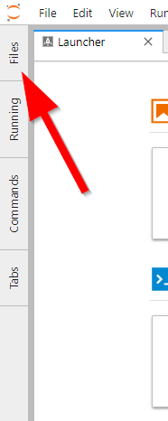
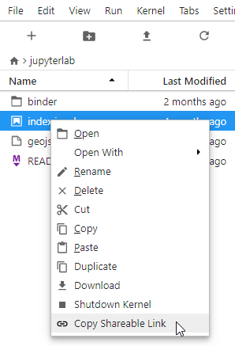

.. _working-with-files:

Working with Files
------------------

打开文件
~~~~~~~~~~~~~

使用文件浏览器和“文件”菜单可以处理系统上的文件和目录。 这包括打开，创建，删除，重命名，下载，复制和共享文件和目录。

文件浏览器位于左侧边栏“文件”选项卡中：

对文件的许多操作也可以在“文件”菜单中执行：

.. image:: images/file_menu_top.png
   :align: center
   :class: jp-screenshot

.. _open-file:

要打开任何文件，请在文件浏览器中双击其名称：

.. raw:: html

  

     <iframe src="https://www.youtube-nocookie.com/embed/Rh-vwjTwBTI?rel=0&amp;showinfo=0" frameborder="0" allow="autoplay; encrypted-media" allowfullscreen></iframe>
  

.. _newtab:

你还可以将文件拖到主工作区中以创建新选项卡：

.. raw:: html

  

     <iframe src="https://www.youtube-nocookie.com/embed/uwMmHeDmRxk?rel=0&amp;showinfo=0" frameborder="0" allow="autoplay; encrypted-media" allowfullscreen></iframe>
  

.. _multiple-viewers:

许多文件类型都有:ref:`多个视图/编辑器 <file-and-output-formats>`。 例如，您可以在 :ref:`文本编辑器 <file-editor>` 中打开Markdown文件，也可以将其作为呈现的HTML打开。 JupyterLab 扩展还可以为文件添加新的查看器/编辑器。 要在非默认查看器/编辑器中打开文件，请在文件浏览器中右键单击其名称，然后使用“Open With…”子菜单选择查看器/编辑器：

.. raw:: html

  

     <iframe src="https://www.youtube-nocookie.com/embed/1kEgUqAeYo0?rel=0&amp;showinfo=0" frameborder="0" allow="autoplay; encrypted-media" allowfullscreen></iframe>
  

.. _single-doc-sync:

可以在多个查看器/编辑器中同时打开单个文件，它们将保持同步：

.. raw:: html

  

     <iframe src="https://www.youtube-nocookie.com/embed/87ALbxm1Y3I?rel=0&amp;showinfo=0" frameborder="0" allow="autoplay; encrypted-media" allowfullscreen></iframe>
  

.. _file-navigation:

可以通过双击列表中的文件夹或单击目录列表顶部的文件夹来导航文件系统：

.. raw:: html

  

     <iframe src="https://www.youtube-nocookie.com/embed/2OHwJzjG-l4?rel=0&amp;showinfo=0" frameborder="0" allow="autoplay; encrypted-media" allowfullscreen></iframe>
  

.. _file-share:

右键单击文件或目录，然后选择“Copy Shareable Link”以复制可用于打开JupyterLab的URL，并打开该文件或目录。

.. _file-copy-path:

右键单击文件或目录，然后选择“Copy Path”以复制文件系统相对路径。 这可以用于将参数传递给各种内核中调用的函数中的打开文件。

创建文件和活动
~~~~~~~~~~~~~~~~~~~~~~~~~~~~~

.. _file-create-plus:

单击文件浏览器顶部的 ``+`` 按钮创建新文件或活动。 这将在主工作区中打开一个新的Launcher选项卡，使您可以选择一个活动和内核：

.. raw:: html

  

     <iframe src="https://www.youtube-nocookie.com/embed/QL0IxDAOEc0?rel=0&amp;showinfo=0" frameborder="0" allow="autoplay; encrypted-media" allowfullscreen></iframe>
  

.. _file-create-menu:

您还可以使用“文件”菜单创建新文档或活动：

.. image:: images/file_create_text_file.png
   :align: center
   :class: jp-screenshot

.. _current-directory:

新活动或文档的当前工作目录将是文件浏览器中列出的目录（Terminal除外，它始终在文件浏览器的根目录中启动）：

.. raw:: html

  

     <iframe src="https://www.youtube-nocookie.com/embed/OfISSOTiGTY?rel=0&amp;showinfo=0" frameborder="0" allow="autoplay; encrypted-media" allowfullscreen></iframe>
  

.. _file-rename:

使用默认名称创建新文件。 通过在文件浏览器中右键单击其名称并从上下文菜单中选择 “Rename” 来重命名文件：

.. raw:: html

  

     <iframe src="https://www.youtube-nocookie.com/embed/y3xzXelypjs?rel=0&amp;showinfo=0" frameborder="0" allow="autoplay; encrypted-media" allowfullscreen></iframe>
  

上传和下载
~~~~~~~~~~~~~~~~~~~~~~~~~

.. _file-upload:

通过将文件拖放到文件浏览器上，或者通过单击文件浏览器顶部的“Upload Files”按钮，可以将文件上载到文件浏览器的当前目录：

.. raw:: html

  

     <iframe src="https://www.youtube-nocookie.com/embed/1bd2QHqQSH4?rel=0&amp;showinfo=0" frameborder="0" allow="autoplay; encrypted-media" allowfullscreen></iframe>
  

.. _file-download:

可以通过在文件浏览器中右键单击其名称并从上下文菜单中选择“Download”来下载JupyterLab中的任何文件：

.. raw:: html

  

     <iframe src="https://www.youtube-nocookie.com/embed/Wl7Ozl6rMcc?rel=0&amp;showinfo=0" frameborder="0" allow="autoplay; encrypted-media" allowfullscreen></iframe>
  

