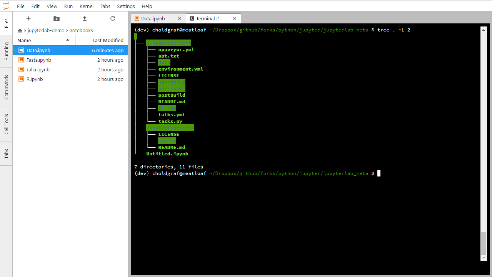

.. _terminal:

终端（Terminals）
----------------------

JupyterLab 终端在Mac / Linux和Windows上的PowerShell上提供对系统shell（bash，tsch等）的完全支持。 您可以使用终端在系统shell中运行任何内容，包括vim或emacs等程序。 终端在运行Jupyter服务器的系统上运行，具有用户的权限。 因此，如果JupyterLab安装在本地计算机上，则JupyterLab终端将在那里运行。

.. _open-terminal:

要打开新终端，请单击文件浏览器中的 ``+`` 按钮，然后在新的Launcher选项卡中选择终端：

.. raw:: html

  

     <iframe src="https://www.youtube-nocookie.com/embed/ynMjz1tiq9o?rel=0&amp;showinfo=0" frameborder="0" allow="autoplay; encrypted-media" allowfullscreen></iframe>
  

.. _close-terminal:

关闭终端选项卡将使其在服务器上运行，但您可以使用左侧栏中的运行选项卡重新打开它：

.. raw:: html

  

     <iframe src="https://www.youtube-nocookie.com/embed/gDM5lwU6Dmo?rel=0&amp;showinfo=0" frameborder="0" allow="autoplay; encrypted-media" allowfullscreen></iframe>
  

